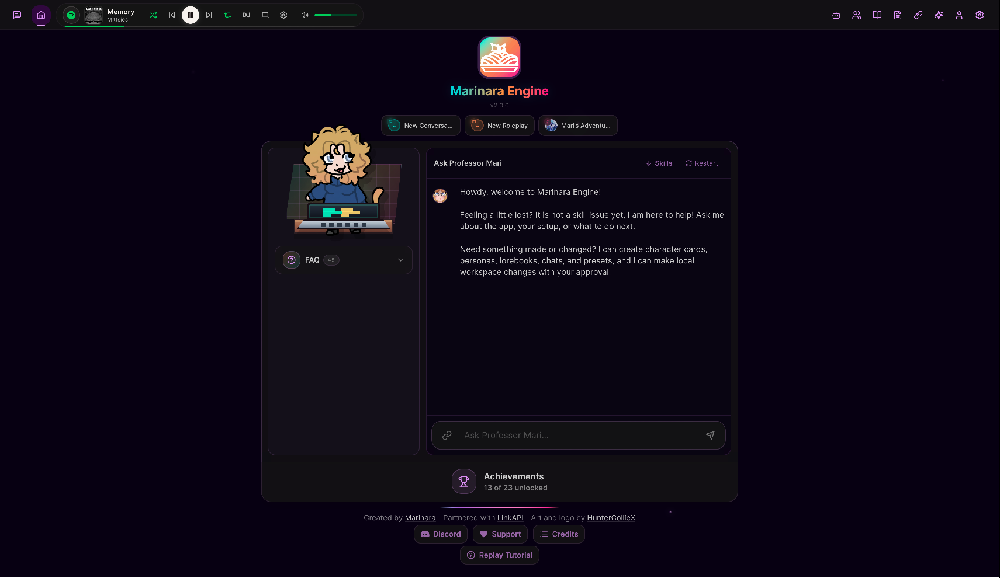

# 🍝 Marinara Engine

<h3 align="center"><b>Fun. Intuitive. Plug-And-Play.</b></h3>

<p align="center">
  <b>A local, AI-powered chat, roleplay, and game (coming soon) engine</b> built around one idea: <b>you install it, you run it, and it just works. Oh, and don't forget about the part where you have fun! ALSO, HEY, LOOK, IT'S FREE.</b><br/>
  Created with agentic use in mind, allowing multiple requests at once. Everything is connected. Chat with your characters OOC about your roleplays. Have them create RP scenes for you. All designed with simplicity in mind: we don't want to spend hours on setup, we just want to <s>goon</s> play.<br/>
</p>

---

> **⚠️ Alpha Software** — This is an early release. Expect rough edges, missing features, and breaking changes between versions. Bug reports and feedback are very welcome!

---

## Screenshots

<p align="center">
  
  <br/>
  <em>Roleplay Mode — Character sprites, custom backgrounds, weather effects, and AI agents</em>
</p>

<p align="center">
  
  &nbsp;&nbsp;
  
</p>
<p align="center">
  <em>Home screen &nbsp;&nbsp;·&nbsp;&nbsp; Guided onboarding</em>
</p>

<p align="center">
  
  &nbsp;&nbsp;
  
</p>
<p align="center">
  <em>Conversation Mode — Discord-style DMs with selfies and image generation</em>
</p>

<p align="center">
  
  &nbsp;&nbsp;&nbsp;&nbsp;
  
</p>
<p align="center">
  <em>Fully responsive — works on phones and tablets via PWA</em>
</p>

---

## Changelog

### v1.4.6

**New Features:**

- **Embedding Base URL** — Configurable base URL for embedding endpoints, allowing custom embedding servers per connection.
- **Browser Refresh on Error** — The Bot Browser tab now shows a "Refresh" button when search fails, instead of a static error message.

**Improvements:**

- **Performance — Streaming Re-render Optimization** — Extracted `StreamingIndicator` and `RegeneratingMessageContent` into self-contained components that subscribe to the stream buffer independently. The main `ChatArea` no longer re-renders on every token (~30–60×/sec), drastically reducing CPU usage during streaming.
- **Performance — Zustand Selector Batching** — Combined 5 individual `useUIStore` selectors in `ChatMessage` into a single shallow-compared selector via `useShallow`, and memoized style objects (`textStrokeStyle`, `narrationTextStyle`, `chatTextStyle`, bubble colors) to avoid recreating them on every render.
- **Performance — Debounced UI Persistence** — UI store `localStorage` writes are now debounced (1 s) via a custom `createJSONStorage` adapter, preventing synchronous I/O on every state change (e.g. dragging sliders).
- **Performance — Action Selector Cleanup** — Converted 4 action-only selectors (`setActiveChat`, `setShouldOpenSettings`, `setShouldOpenWizard`, and callback-only `setActiveChatId`) to `getState()` calls, eliminating unnecessary re-render subscriptions.
- **Chat Text Appearance** — Unified chat text color with a single "Chat Text Color" setting and a default text stroke width of 0.5 px.
- **Settings Panel Polish** — Renamed reset buttons to "Reset to default", removed redundant labels ("Color", "From"/"To"), and consolidated reset actions (text color reset also resets opacity to 90 %).
- **Roleplay Input Responsiveness** — Responsive padding/gap on the roleplay input bar, `min-w-0` on the textarea to prevent flex overflow on narrow screens, and `shrink-0` on the send button.
- **Home Page Mobile Layout** — Reduced padding on mobile (`p-4 sm:p-8`), constrained content width (`max-w-md`), and made QuickStart cards flex-wrap with responsive sizing (`w-24 sm:w-28`).
- **Folder UX** — New folders are created at the top of the list (server-side `sortOrder: 0` with existing folders shifted), folders render above unfiled chats, and the folder row now uses inline rename-on-click + a trash icon on hover instead of a three-dot menu.

**Bug Fixes:**

- **Fixed infinite re-render loop** — The combined Zustand object selector in `ChatMessage` returned a new reference every render, bypassing `memo()` and causing "Maximum update depth exceeded". Fixed by wrapping with `useShallow()`.
- **Fixed message background opacity** — Roleplay message bubbles used `rgba(0,0,0,…)` instead of the correct `rgba(23,23,23,…)` matching Tailwind's `bg-neutral-900/70` and `bg-neutral-900/60`.
- **Fixed new folders appearing at the bottom** — Two-part fix: server assigns `sortOrder: 0` to new folders (shifting existing ones down), and the client renders folders before unfiled chats.
- **Fixed missing DB column migrations** — Added `openrouter_provider`, `comfyui_workflow`, and `embedding_base_url` to `COLUMN_MIGRATIONS` so they auto-create on startup.
- **Fixed combat encounter `parseJSON`** — Corrected escape-sequence detection and added 3-level sanitization for AI responses in the combat agent.

### v1.4.5

**New Features:**

- **Buttplug.io Haptic Integration** — "Love Toys Control" agent with per-device capability detection and 6 haptic actions (vibrate, oscillate, rotate, position, stop, constrict). Characters can trigger device commands inline via `<haptic>` tags.
- **CYOA Choices Agent** — Generates 2–4 in-character choices after each roleplay response. Click a choice to send it as your next message.
- **Multi-Select Message Deletion** — Select and bulk-delete messages in both Conversation and Roleplay modes via a new dialog flow.
- **Echo Chamber Persistence** — Echo messages are now saved to the database and restored when switching back to a chat.
- **Profile Export/Import** — Full backup and restore of characters, personas, lorebooks, presets, and agent configs as a single JSON file.
- **Always-Enabled Send Button** — Roleplay mode now always shows a send/generate button with smart continue logic.

**Improvements:**

- **Responsive Layout** — Auto-closing panels on narrow screens, improved breakpoints, `min-w-0` overflow fix on AppShell.
- **Accessibility** — Message multi-select checkboxes now use proper `<button role="checkbox">` with `aria-checked` and `aria-label`.
- **Security** — Bulk message deletes are now scoped to the chat's `chatId`, preventing cross-chat deletion.
- **Validation** — `Number.isFinite()` guards on haptic intensity/duration in both the service layer and command parser.
- **Robustness** — Bulk deletes are chunked (500/batch) to avoid hitting SQLite's variable limit.
- **Echo Chamber** — `loadedChatRef` reset on toggle-off for proper reload on re-enable.
- **Haptic Safety** — Invalid device indices now return an empty target list instead of falling back to all connected devices.

**Bug Fixes:**

- Fixed the Echo Chamber agent count badge not updating.
- Fixed combat agent type mismatch error.
- Fixed Character Menu `.marinara` file import failing silently.
- "Clear Trackers" now also clears committed agent runs and agent memory from the database.
- Removed unused connections data from profile export envelope.

---

## Installation

## Windows EASIEST METHOD

Download **[Marinara-Engine-Installer-1.4.6.exe](https://github.com/SpicyMarinara/Marinara-Engine/releases/download/v1.4.6/Marinara-Engine-Installer-1.4.6.exe)** from the [Releases](https://github.com/SpicyMarinara/Marinara-Engine/releases) page and run it. The installer checks for Node.js and Git, clones the repo, installs dependencies, builds the app, and creates a desktop shortcut.

---

## Alternatives

### Run from Source (All Platforms)

### Prerequisites

You need **Node.js** and **Git** installed before running Marinara Engine. pnpm is handled automatically by the start script.

**Install Node.js v20+:**

| Platform              | How to Install                                                                                  |
| --------------------- | ----------------------------------------------------------------------------------------------- |
| Windows               | Download the installer from [nodejs.org](https://nodejs.org/en/download) and run it             |
| macOS                 | `brew install node` or download from [nodejs.org](https://nodejs.org/en/download)               |
| Linux (Ubuntu/Debian) | `curl -fsSL https://deb.nodesource.com/setup_22.x \| sudo bash - && sudo apt install -y nodejs` |
| Linux (Fedora)        | `sudo dnf install -y nodejs`                                                                    |
| Linux (Arch)          | `sudo pacman -S nodejs npm`                                                                     |

**Install Git:**

| Platform              | How to Install                                                                      |
| --------------------- | ----------------------------------------------------------------------------------- |
| Windows               | Download from [git-scm.com](https://git-scm.com/download/win) and run the installer |
| macOS                 | `brew install git` or install Xcode Command Line Tools: `xcode-select --install`    |
| Linux (Ubuntu/Debian) | `sudo apt install -y git`                                                           |
| Linux (Fedora)        | `sudo dnf install -y git`                                                           |
| Linux (Arch)          | `sudo pacman -S git`                                                                |

Verify both are installed:

```bash
node -v   # should show v20 or higher
git -v    # should show git version 2.x+
```

### Quick Start

**Windows:**

```bat
git clone https://github.com/SpicyMarinara/marinara-engine.git
cd marinara-engine
start.bat
```

**macOS / Linux:**

```bash
git clone https://github.com/SpicyMarinara/marinara-engine.git
cd marinara-engine
chmod +x start.sh
./start.sh
```

**Android (Termux):**

Install [Termux](https://f-droid.org/en/packages/com.termux/) from F-Droid (the Play Store version is outdated), then run:

```bash
pkg update && pkg install -y git nodejs-lts && npm install -g pnpm && git clone https://github.com/SpicyMarinara/marinara-engine.git && cd marinara-engine && chmod +x start-termux.sh && ./start-termux.sh
```

The Termux launcher handles everything automatically — it downloads a prebuilt native module, installs dependencies, builds the app, and starts the server at `http://localhost:7860`. First run takes a few minutes on mobile. After that, just run `./start-termux.sh` to start.

> **Tip:** Install the PWA — tap the browser menu and "Add to Home Screen" for a native app feel.

The start script will:

1. **Auto-update** from Git (if a `.git` folder is detected)
2. Check that Node.js and pnpm are installed
3. Install all dependencies (first run only)
4. Build the application
5. Initialize the database
6. Start the server and open `http://localhost:7860` in your browser

### Manual Setup

```bash
git clone https://github.com/SpicyMarinara/marinara-engine.git
cd marinara-engine
pnpm install
pnpm build
pnpm db:push
pnpm start
```

Then open **<http://localhost:7860>**. That's it — no account, no cloud, everything runs locally.

### Updating

**Updates are automatic.** Every time you launch Marinara Engine via `start.sh`, `start.bat`, or `start-termux.sh`, the launcher:

1. Pulls the latest code from GitHub (`git pull`)
2. Detects if anything changed
3. Reinstalls dependencies and rebuilds automatically
4. Runs database migrations

**You don't need to do anything** — just launch the app as usual, and you'll always be on the latest version.

This works for all platforms: Windows (installer or manual), macOS, Linux, and Termux.

To update manually (e.g., if you don't use the start scripts):

```bash
git pull
pnpm install
pnpm build
pnpm db:push
```

Then restart the server.

---

## Accessing from Mobile (or Another Device)

If you're running Marinara Engine on your computer and want to use it from your phone or tablet on the same network:

1. **Find your computer's local IP address:**
   - **Windows:** Open a terminal and run `ipconfig` — look for `IPv4 Address` (usually something like `192.168.x.x`)
   - **macOS:** Go to System Settings → Wi-Fi → click your network → look for `IP Address`, or run `ipconfig getifaddr en0`
   - **Linux:** Run `hostname -I` or `ip addr`

2. **Open a browser on your phone** (Chrome, Brave, Safari, etc.) and go to:

   ```
   http://<your-computer-ip>:7860
   ```

   For example: `http://192.168.1.42:7860`

3. **Install the PWA** — tap the browser menu and "Add to Home Screen" for a native app feel.

> **Tip:** If you're not on the same Wi-Fi, tools like [Tailscale](https://tailscale.com/) give each device a stable IP address on a private network — install it on both devices, then use your computer's Tailscale IP instead.

---

## Development

```bash
# Start both server + client with hot reload
pnpm dev

# Server only (port 7860)
pnpm dev:server

# Client only (port 5173, proxies API to server)
pnpm dev:client
```

---

## Features

### Chat & Roleplay

- **Three Chat Modes** — Conversation (Discord-style), Roleplay (immersive RPG), Game (Coming Soon)
- **Plug-And-Play** — I couldn't have made it easier for you.
- **A Connected System** — All chats can be connected, your characters carry memories between them and are aware of them. It's an immersive system that aims to make you feel like you're chatting with real people.
- **Character Management** — Create or import characters with avatars, personalities, backstories, and system prompts
- **Avatar Zoom & Repositioning** — Crop and reposition character avatars with a zoom slider and drag-to-pan, applied everywhere avatars appear
- **Persona System** — User personas with custom names, avatars, and descriptions
- **Group Chats** — Multiple characters in a single conversation
- **Chat Branching** — Branch conversations at any message and explore different paths
- **Message Swiping** — Generate alternate responses and swipe between them
- **Slash Commands** — `/narrator`, `/random`, `/sys`, `/as`, `/continue`, `/impersonate`, and more for quick chat control
- **SillyTavern Import** — Migrate characters, chats, presets, and settings from SillyTavern

### Visual & Immersive

- **Sprite System** — Character expression sprites with automatic emotion-based switching
- **Custom Backgrounds** — Upload backgrounds with per-scene switching
- **Weather Effects** — Dynamic weather overlays (rain, snow, fog, etc.)
- **Two Visual Themes** — Y2K Marinara theme and a faithful SillyTavern classic theme
- **Light & Dark Mode** — One is obviously superior.

### AI Agent System (25 Built-In)

Agents are autonomous AI assistants that run alongside your chat, each handling a specific task:

| Agent                     | What It Does                                                                 |
| ------------------------- | ---------------------------------------------------------------------------- |
| **World State**           | Tracks date/time, weather, location, and present characters                  |
| **Quest Tracker**         | Manages quest objectives, completion, and rewards                            |
| **Character Tracker**     | Monitors character moods, relationships, appearance, outfit, and stats       |
| **Persona Stats**         | Tracks your protagonist's needs and condition bars (Satiety, Energy, etc.)   |
| **Custom Tracker**        | Tracks user-defined fields — currencies, counters, flags, or any custom data |
| **Narrative Director**    | Introduces events, NPCs, and plot beats to keep the story moving             |
| **Prose Guardian**        | Analyzes writing patterns and generates directives to improve prose variety  |
| **Continuity Checker**    | Detects contradictions with established lore and facts                       |
| **Combat**                | Turn-based RPG combat with initiative, HP tracking, and actions              |
| **Expression Engine**     | Detects emotions and selects character sprites                               |
| **Background**            | Picks the best background image for the current scene                        |
| **Echo Chamber**          | Simulates a live-stream chat reacting to your roleplay                       |
| **Prompt Reviewer**       | Reviews and scores the assembled prompt before generation                    |
| **Illustrator**           | Generates image prompts for key scenes                                       |
| **Lorebook Keeper**       | Automatically creates and updates lorebook entries                           |
| **Immersive HTML**        | Injects styled HTML/CSS/JS for in-world visuals (letters, terminals, etc.)   |
| **Consistency Editor**    | Edits responses to fix factual errors and tracker contradictions             |
| **Spotify DJ**            | Controls Spotify playback to match the scene's mood                          |
| **Chat Summary**          | Generates condensed rolling summaries of long conversations                  |
| **Knowledge Retrieval**   | Scans lorebooks for relevant context using chunked RAG                       |
| **Schedule Planner**      | Generates realistic weekly schedules for characters in Conversation mode     |
| **Response Orchestrator** | Decides which character(s) should respond in group Conversations             |
| **Love Toys Control**     | Controls Buttplug.io haptic devices with per-device capability awareness     |
| **CYOA Choices**          | Generates 2–4 in-character choices for the player after each response        |
| **Autonomous Messenger**  | Allows characters to send messages unprompted when the user is inactive      |

All agents are disabled by default — enable only the ones you want. You can also create **custom agents** with your own prompts and tool configurations.

### Prompt Engineering

- **Preset System** — Save and load full prompt configurations (system prompt sections, sampling parameters, etc.)
- **Prompt Sections** — Modular prompt builder with drag-and-drop ordering, depth injection, and per-section toggles
- **Lorebooks** — World-building entries with keyword triggers that inject context automatically
- **World Info Inspector** — Live view of active lorebook entries in the current chat, with token usage and keyword details
- **Lorebook Token Counts & Sorting** — Estimated token counts per entry, sortable by order, name, tokens, or keys
- **Regex Scripts** — Custom text processing with regex find/replace on inputs and outputs
- **Macro System** — Template variables like `{{char}}`, `{{user}}`, `{{time}}`, and agent markers

### Connections & Providers

- **Multi-Provider** — OpenAI, Anthropic, Google, OpenRouter, Mistral, Cohere, and any custom OpenAI-compatible endpoint
- **Encrypted API Keys** — API keys are encrypted at rest with AES-256
- **Per-Chat Overrides** — Different presets and connections per chat

### Export & Data

- **Export Chats** — Save as JSON or Markdown
- **Fully Local** — SQLite database, all data stays on your machine
- **No Account Required** — Just install and go

---

## Configuration

Copy `.env.example` to `.env` to customize:

| Variable         | Default                          | Description                                                                                                                                                   |
| ---------------- | -------------------------------- | ------------------------------------------------------------------------------------------------------------------------------------------------------------- |
| `PORT`           | `7860`                           | Server port                                                                                                                                                   |
| `HOST`           | `0.0.0.0`                        | Bind address                                                                                                                                                  |
| `DATABASE_URL`   | `file:./data/marinara-engine.db` | SQLite database path                                                                                                                                          |
| `ENCRYPTION_KEY` | _(empty)_                        | AES key for API key encryption (generate with `openssl rand -hex 32`)                                                                                         |
| `LOG_LEVEL`      | `info`                           | Logging verbosity                                                                                                                                             |
| `CORS_ORIGINS`   | `http://localhost:5173`          | Allowed CORS origins                                                                                                                                          |
| `SSL_CERT`       | _(empty)_                        | Path to TLS certificate (e.g., `fullchain.pem`). Set both `SSL_CERT` and `SSL_KEY` to enable HTTPS                                                            |
| `SSL_KEY`        | _(empty)_                        | Path to TLS private key (e.g. `privkey.pem`)                                                                                                                  |
| `IP_ALLOWLIST`   | _(empty)_                        | Comma-separated IPs or CIDRs to allow (e.g. `192.168.1.100,10.0.0.0/24`). When set, all other IPs are blocked. Loopback (`127.0.0.1`/`::1`) is always allowed |

---

## Project Structure

```text
marinara-engine/
├── packages/
│   ├── shared/      # TypeScript types, schemas, constants
│   ├── server/      # Fastify API + SQLite database + AI agents
│   └── client/      # React frontend (Vite + Tailwind v4)
├── start.bat        # Windows launcher
├── start.sh         # macOS/Linux launcher
└── .env.example     # Environment template
```

## Tech Stack

| Layer    | Technology                                                     |
| -------- | -------------------------------------------------------------- |
| Frontend | React 19, Tailwind CSS v4, Framer Motion, Zustand, React Query |
| Backend  | Fastify 5, Drizzle ORM, SQLite                                 |
| PWA      | vite-plugin-pwa, Web App Manifest                              |
| Shared   | TypeScript 5, Zod                                              |
| Build    | Vite 6, pnpm workspaces                                        |

---

## Troubleshooting

### Windows: `EPERM: operation not permitted` when installing pnpm

If you see an error like `EPERM: operation not permitted, open 'C:\Program Files\nodejs\yarnpkg'` or a corepack signature verification failure, this is a Windows permissions issue — corepack can't write to `C:\Program Files\nodejs\`.

**Fix (pick one):**

1. **Run as Administrator** — Right-click your terminal (CMD or PowerShell) and select "Run as administrator", then run `start.bat` again.

2. **Install pnpm manually** (recommended — avoids corepack entirely):

   ```bash
   npm install -g pnpm
   ```

   Then run `start.bat` again.

3. **Update corepack** (if you want to keep using it):

   ```bash
   npm install -g corepack
   corepack enable
   corepack prepare pnpm@latest --activate
   ```

   Run these in an Administrator terminal.

---

## Community & Support

- [**Join our Discord**](https://discord.com/invite/KdAkTg94ME) — Chat, get help, share characters, and give feedback
- [**Support on Ko-fi**](https://ko-fi.com/marinara_spaghetti) — Help keep the project alive

---

## Contributors

- [Spicy Marinara](https://github.com/SpicyMarinara)
- [Jorge Becerra](https://github.com/JorgeLTE)
- [Coda](https://github.com/coxde)
- [Andy Mauragis](https://github.com/amauragis)

---

## License

[AGPL-3.0](LICENSE)
